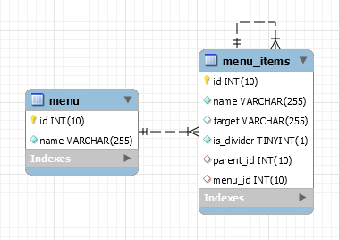

# Menu

This package allows you to easily build a hierarchical menu from PHP. It's inspired by 
[Crisp's blogpost](https://crisp.tweakblogs.net/blog/317/formatting-a-multi-level-menu-using-only-one-query.html) but 
further implemented.

## Requirements

This package requires PHP 7 and the renderers make use of [vdhicts/htmlelement](https://github.com/vdhicts/html-element).

## Installation

This package can be used in any PHP project or with any framework.

You can install the package via composer:

``` bash
composer require vdhicts/menu-builder
```

## Usage

```php
use Vdhicts\MenuBuilder;
    
$item = new MenuBuilder\Item(1, 'Search engines');
$subItemGoogle = new MenuBuilder\Item(2, 'Google', 'http://www.google.com', $item->getId());
$subItemBing = new MenuBuilder\Item(3, 'Bing', 'http://www.bing.com', $item->getId());
    
$itemCollection = new MenuBuilder\ItemCollection();
$itemCollection->addItem($item)
    ->addItem($subItemGoogle)
    ->addItem($subItemBing);
    
$renderer = new MenuBuilder\Renderers\Navbar();
$menuBuilder = new MenuBuilder\Builder($itemCollection, $navbar);
$menuBuilder->generate();
```

### Renderers

There are 3 renderers available by default:

#### List group

Usefull for things like sidebars or sidemenu's. Renders the menu as a Bootstrap list-group component:

```html
<ul class="list-group">
    <li class="list-group-item">Search engines
        <ul class="list-group">
            <li class="list-group-item">
                <a href="http://www.google.com">Google</a>
            </li>
            <li class="list-group-item list-group-item-divider"></li>
            <li class="list-group-item">
                <a href="http://www.bing.com">Bing</a>
            </li>
        </ul>
    </li>
</ul>
```

#### List inline

Usefull for things like footers. Renders the menu as a Bootstrap list-inline component:

```html
<ul class="list-inline">
    <li>Search engines
        <ul class="list-inline">
            <li>
                <a href="http://www.google.com">Google</a>
            </li>
            <li class="list-inline-divider"></li>
            <li>
                <a href="http://www.bing.com">Bing</a>
            </li>
        </ul>
    </li>
</ul>
```

#### Navbar 

This generates the content of the navbar, so additional HTML is needed to provide the full navbar.

```html
<ul class="nav navbar-nav">
    <li class="dropdown">
        <a href="#" class="dropdown-toggle" data-toggle="dropdown">Search engines<span class="caret"></span></a>
        <ul class="dropdown-menu">
            <li>
                <a href="http://www.google.com">Google</a>
            </li>
            <li class="divider" role="separator"></li>
            <li>
                <a href="http://www.bing.com">Bing</a>
            </li>
        </ul>
    </li>
</ul>
```

#### Custom renderer

You can use your own renderer as long as it implements the `Renderer` interface.

### Database

When storing the data in a database, you should at least have an `id`, `parentId` and `name`. The id isn't limited to 
integers so a UUID or slug should work too.

To help you get started, use the following sql to generate the menu tables.

```sql
CREATE TABLE `menu` (
  `id` int(10) unsigned NOT NULL AUTO_INCREMENT,
  `name` varchar(255) NOT NULL,
  PRIMARY KEY (`id`)
) ENGINE=InnoDB DEFAULT CHARSET=latin1;

CREATE TABLE `menu_items` (
  `id` int(10) unsigned NOT NULL AUTO_INCREMENT,
  `name` varchar(255) NOT NULL,
  `target` varchar(255) DEFAULT NULL,
  `is_divider` tinyint(1) unsigned NOT NULL DEFAULT '0',
  `parent_id` int(10) unsigned DEFAULT NULL,
  `menu_id` int(10) unsigned NOT NULL,
  PRIMARY KEY (`id`),
  KEY `menu_items_could_have_a_parent` (`parent_id`),
  KEY `menu_items_could_belongs_to_a_menu` (`menu_id`),
  CONSTRAINT `menu_items_could_belongs_to_a_menu` FOREIGN KEY (`menu_id`) REFERENCES `menu` (`id`) ON DELETE CASCADE ON UPDATE NO ACTION,
  CONSTRAINT `menu_items_could_have_a_parent` FOREIGN KEY (`parent_id`) REFERENCES `menu_items` (`id`) ON DELETE CASCADE ON UPDATE NO ACTION
) ENGINE=InnoDB DEFAULT CHARSET=latin1;
```

This generates a menu table in which you can store the menu itself. This enables you to have several different menu's.
Also the menu items table is generated which has a foreign key to the menu and to its parent menu item.



To retrieve the items, just execute the following query:

```sql
SELECT 
  `id`, 
  `parent_id`, 
  `name`
FROM
  `menu_items`
WHERE
  `menu_id` = 1
ORDER BY
  `parent_id`, `name`
```

In which you should replace the menu id.

## Tests

Full code coverage unit tests are available in the `tests` folder. Run via phpunit:

`vendor\bin\phpunit`

By default a coverage report will be generated in the `build/coverage` folder.

## Contribution

Any contribution is welcome, but it should be fully tested, meet the PSR-2 standard and please create one pull request 
per feature. In exchange you will be credited as contributor on this page.

## License

This package is open-sourced software licensed under the [MIT license](http://opensource.org/licenses/MIT)
